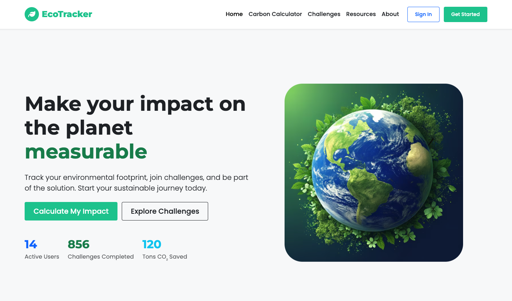
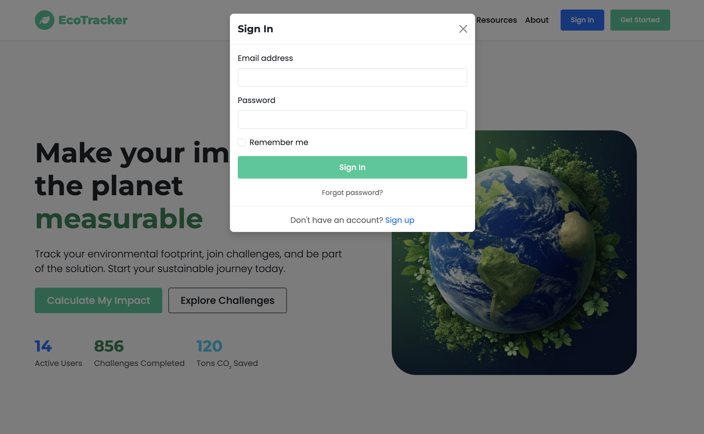
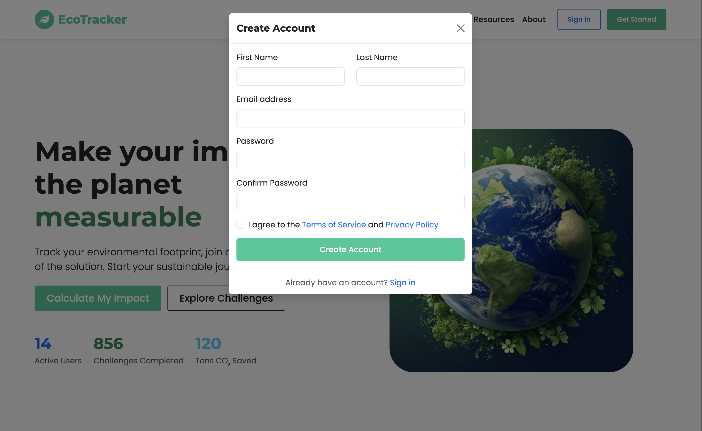
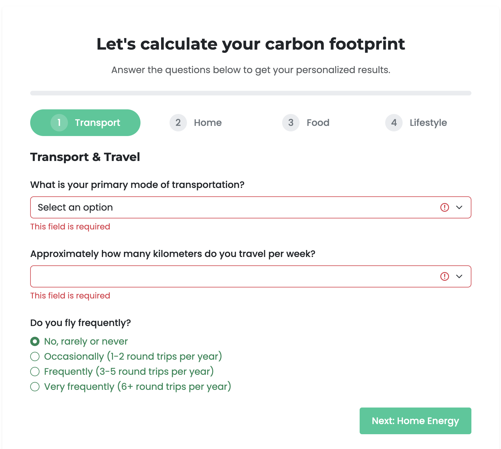
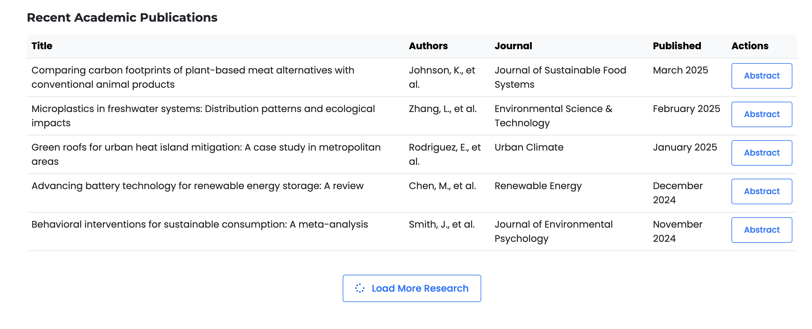
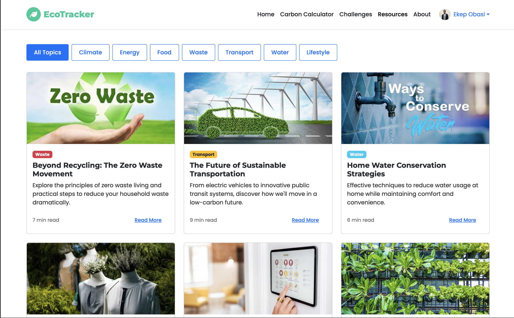

# EcoTracker: Sustainable Living Web Application

## Project Overview

EcoTracker is a web application designed to help users track and reduce their environmental impact through personalized challenge and educational resources. The platform makes sustainable living accessible, measurable, and community-driven by providing tools for carbon footprint calculation, and progress tracking.








## Features

- **Carbon Footprint Calculator**: Interactive assessment tool to measure personal environmental impact across multiple categories
- **Personalized Challenges**: Targeted activities to reduce environmental footprint based on individual habits
- **Educational Resources**: Access to articles, videos, guides, and research on sustainable living
- **User Profiles**: Personalized pages to track individual progress and connect with friends

## Technologies Used

- **HTML5**: Semantic markup for all page content
- **CSS3**: Custom styling with responsive design
- **Bootstrap 5**: Frontend framework for responsive components
- **JavaScript**: Interactive features and form validation
- **Chart.js**: Data visualization for impact tracking
- **Font Awesome**: Icon library for visual elements

## Project Structure

```
Final Project/
├── index.html                   # Homepage
├── pages/                       # Other HTML pages
│   ├── calculator.html          # Carbon Calculator
│   ├── challenges.html          # Challenge Library
│   ├── resources.html           # Educational Resources
│   ├── profile.html             # User Profile
│   └── about.html               # About/Contact
├── css/
│   ├── main.css                 # Main styles
│   ├── components.css           # Reusable components
│   └── pages/                   # Page-specific styles
│       ├── calculator.css
│       └── ...
├── js/
│   ├── main.js                  # Common functions
│   ├── validation.js            # Form validation
│   ├── api.js                   # API interactions
│   └── pages/                   # Page-specific scripts
│       ├── dashboard.js
│       ├── calculator.js
│       └── ...
└── assets/
    ├── images/                  # Image files
    ├── videos/                  # Video files
    └── icons/                   # Icon files
```

## Design Principles

- **Clean and Minimalist**: Focused on content with minimal distractions
- **Data Visualization**: Charts and graphs to make environmental impact tangible
- **Responsive Design**: Optimized for all device sizes from mobile to desktop
- **Accessibility**: WCAG-compliant color contrasts and semantic HTML
- **Consistent Branding**: Cohesive color scheme and typography across all pages

## Key Components

### 1. Carbon Calculator
The multi-step calculator collects data about transportation, home energy use, food choices, and consumption habits to generate a personalized carbon footprint estimate and targeted recommendations.

### 2. Challenge System
Users can join challenges in various categories (transport, food, energy, waste, water) with different difficulty levels. Progress tracking and social sharing encourage completion.

### 3. Resource Library
Curated educational content including articles, videos, guides, and research to help users deepen their understanding of environmental issues and solutions.

## Setup and Installation

1. Clone the repository:
```
git clone https://github.com/Ekep-Obasi/ecotracker.git
```

2. Open the project in your code editor

3. Launch with a local server:
- Using VS Code's Live Server extension

4. View in browser at your server's designated port

## Credits
- Images: Unsplash and Pexels & Random Images on the internet
- Icons: Font Awesome
- Charts: Chart.js
- Front-end Framework: Bootstrap 5